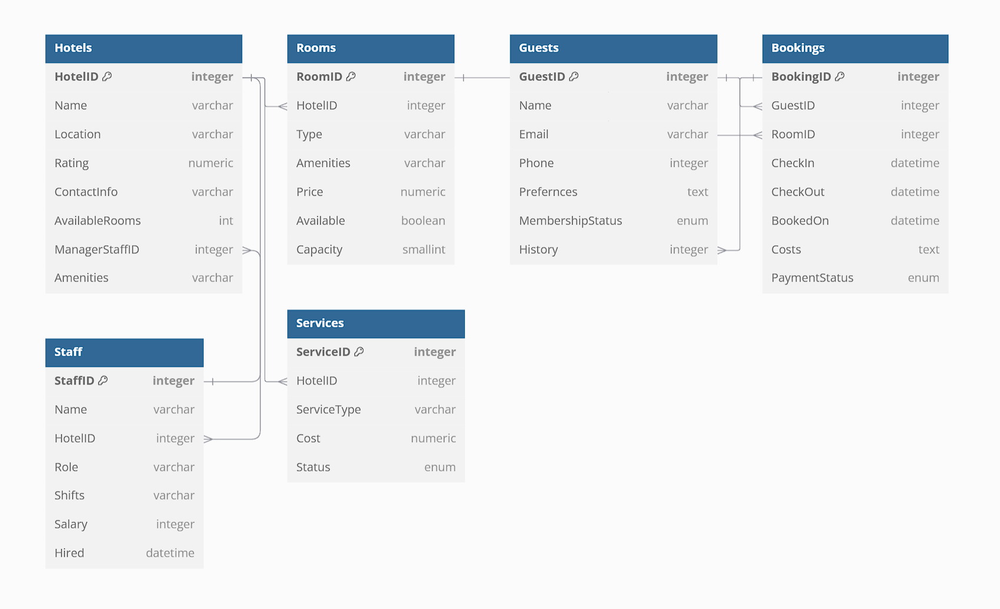

# Hotel-Chain-Database-Design

## Phase 1: Requirments Gathering and Data Mapping]

### Hotels
HotelID PK – unique hotel ID \
Name – specific hotel name \
Location – location of hotel e.g city, country \
Rating – official rating \
ContactInfo – email, phone number for hotel \
AvailableRooms – number of available rooms \
ManagerID FK – staff ID for the current manager \
Amenities – e.g pool, bar, gym

### Rooms
RoomID PK – unique room number \
HotelID FK – what hotel  \
Type – type of room e.g single, double, suite \
Amenities – e.g TV, wifi \
Price – listed price of the room \
Available – if it is currently available \
Capacity – max number of people that can stay 

### Guests
GuestID PK – unique guest number \
Name – full name of guest \
Email – email address \
Phone – phone number \
Preferences – additional preferences or requirements e.g ground floor, blind \
MembershipStatus – if they are currently a member or have been \
History – previous bookings listed here

### Bookings
BookingID PK – unique booking number \
GuestID FK – by what guest \
RoomID FK – what room \
CheckIn – check-in date \
CheckOut – check-out date \
BookedOn – date the guest booked it on \
Costs – cost breakdown including any additional fees \
PaymentStatus – if payment is pending, received, rejected etc

### Staff
StaffID - PK – unique number for each staff member \
Name – full name \
HotelID FK – works at what hotel \
Role – job role e.g. receptionist, chef \
Shifts – shift times e.g Monday – Friday 4pm - 12am \
Salary – current salary \
Hired – date they started

### Services
ServiceID PK – unique number for specific service \
HotelID FK – at what hotel \
ServiceType – e.g child daycare, breakfast \
Cost - price \
Status – if currently available

## Phase 2: Database Schema Design
```
Table Hotels {
  HotelID integer pk
  Name varchar 
  Location varchar
  Rating numeric
  ContactInfo varchar
  AvailableRooms int
  ManagerStaffID integer [ref: > Staff.StaffID] // one-to-one
  Amenities varchar
}

Table Rooms {
  RoomID integer pk
  HotelID integer [ref: > Hotels.HotelID] // many-to-one
  Type varchar
  Amenities varchar
  Price numeric
  Available boolean
  Capacity smallint
}

Table Guests {
  GuestID integer pk
  Name varchar
  Email varchar
  Phone integer
  Prefernces text
  MembershipStatus enum
  History integer [ref: > Bookings.BookingID] // one-to-many
}

Table Bookings {
  BookingID integer pk
  GuestID integer [ref: > Guests.GuestID] // many-to-one
  RoomID integer [ref: > Rooms.RoomID] // one-to-many
  CheckIn datetime 
  CheckOut datetime
  BookedOn datetime
  Costs text
  PaymentStatus enum
}

Table Staff {
  StaffID integer pk
  Name varchar
  HotelID integer [ref: > Hotels.HotelID] // many-to-one
  Role varchar
  Shifts varchar
  Salary integer
  Hired datetime
}

Table Services {
  ServiceID integer pk
  HotelID integer [ref: > Hotels.HotelID] // many-to-one
  ServiceType varchar
  Cost numeric
  Status enum
}
```


